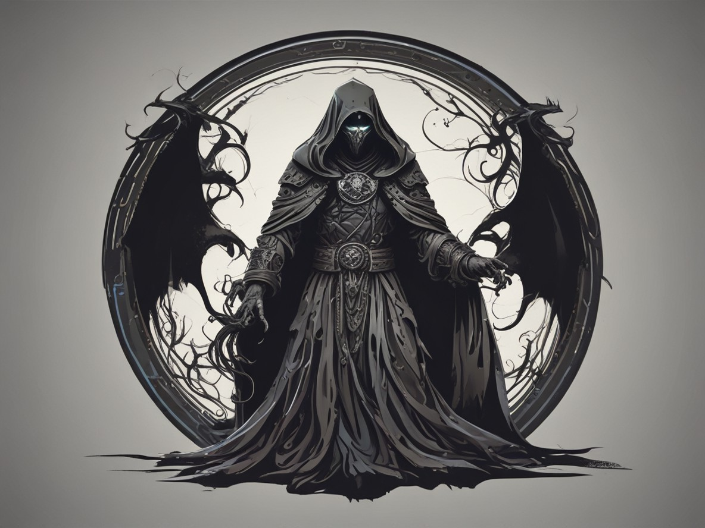

The **Shadow Cultist** is a sinister figure shrouded in mystery, operating under the influence of dark and forbidden powers. They are a member of the Shadow Cult, an organization bent on spreading chaos and corruption. Their skills lie in manipulating shadows, using dark magic to control others and summon dangerous creatures. Throughout the game, the player must unravel the cult's hidden motives, while confronting cultists in covert operations and sinister rituals that threaten the world’s balance.

