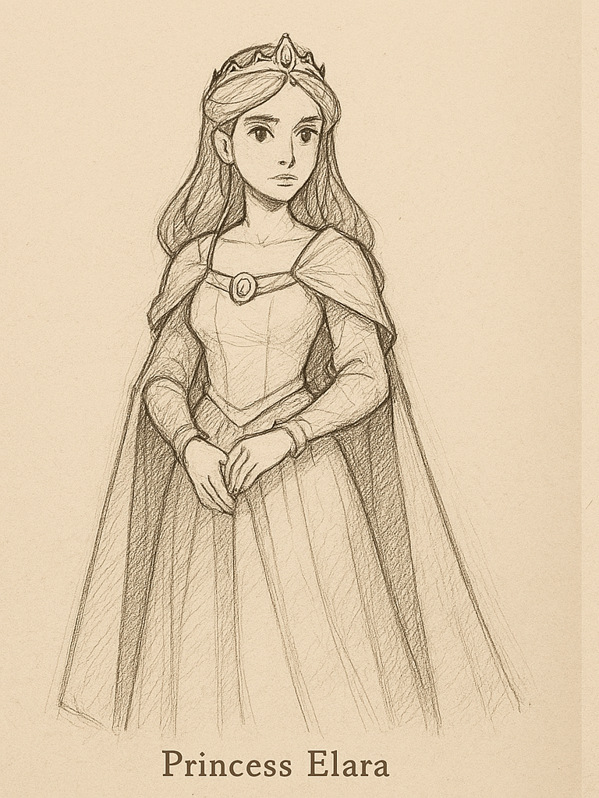

**Princess Elara** is a noble and intelligent royal who is forced to confront the instability of her kingdom after it is overrun by dark forces. Although she initially appears as a damsel in distress, Elara proves to be a resilient leader, capable of rallying others to her cause. Throughout the story, she reveals a deep knowledge of ancient artifacts and magical history, which becomes crucial to the Hero's journey. Elara's character arc explores themes of leadership, sacrifice, and the weight of royal responsibilities.

