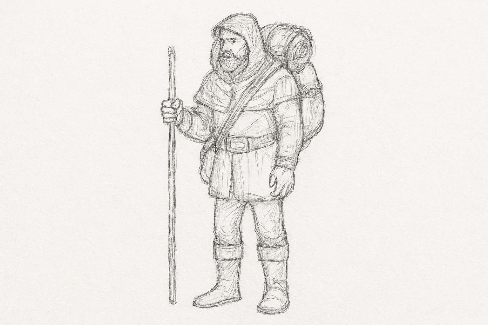
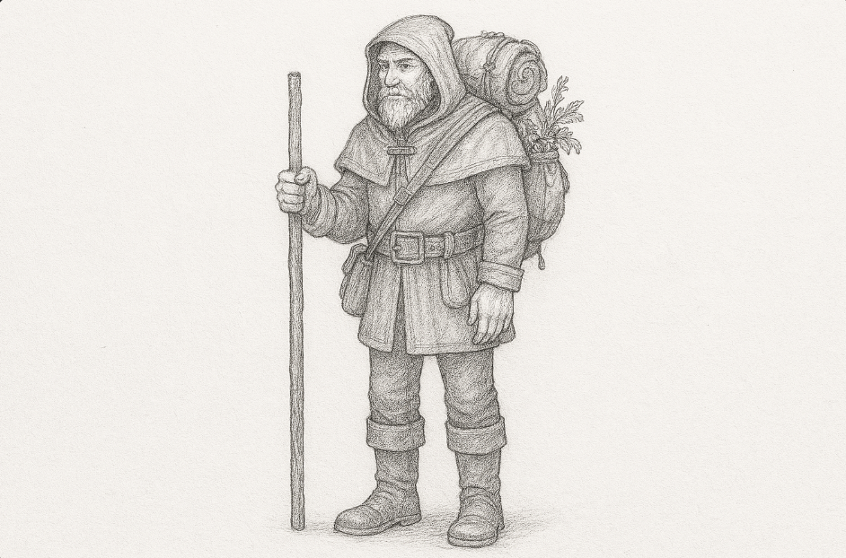

**Thalen Mossroot** is a soft-spoken merchant known throughout the Whispering Vale for his extensive knowledge of alchemical ingredients. With a pack full of exotic herbs and a weathered journal of formulas, he wanders from village to village, offering potent brews and cryptic wisdom. Some say he once studied under a reclusive druid, and his uncanny sense for danger keeps him one step ahead of conflict. Though not a fighter, Thalen knows how to disappear when trouble brews.

