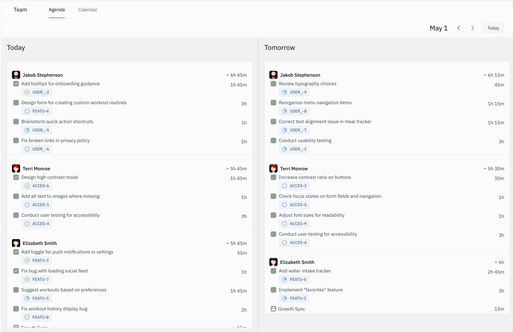
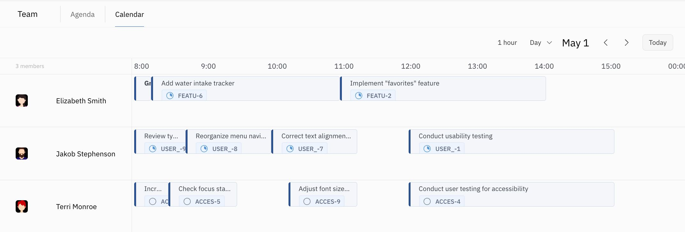

Huly’s **Team Planner** is a powerful tool that provides a bird's-eye view of your team's workflow, enhancing collaboration and efficiency. This is a dedicated space where you can see your team's scheduled activities and progress. 

To understand how to use the Team Planner in Huly, it’s important to understand how Action Items are created and scheduled by team members.

You can access your Team Planner any time by clicking the sun icon in the left sidebar. It won’t look like much until your team starts using Huly to schedule Action Items, but let’s dive in deeper into how this feature can improve your workflows!

### Understand your team’s agenda at a glance

* **Today’s and Tomorrow’s Planned Action Items:** View a clear agenda of what's planned for today and tomorrow. This immediate insight helps in aligning your tasks with the team's priorities and ensures everyone is on the same page.

* **Review Completed Tasks:** Easily track completed Action Items from today, yesterday, and any previous days. This retrospective view not only offers a sense of accomplishment but also aids in evaluating team productivity and planning future tasks more effectively.

### Optimize your team’s efficiency

* **Enhanced Visibility and Coordination:** By having a comprehensive overview of the team's planned and completed Action Items, you can better coordinate efforts, avoid overlaps, and identify areas needing more resources.

* **Streamlined Communication:** The Team Planner reduces the need for constant check-ins and meetings, as team members can directly see each other’s planned and completed tasks, fostering a more efficient workflow.

***Team Planner - Agenda view***

***Team Planner - Calendar view***

As you continue to use Action Items in Huly, you’ll discover how they seamlessly integrate into both your personal and team planning processes, elevating the way you manage and execute tasks. The **Team Planner** is just one of the many ways Huly empowers you and your team to stay organized, synchronized, and productive.