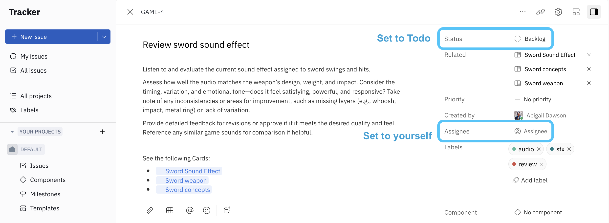
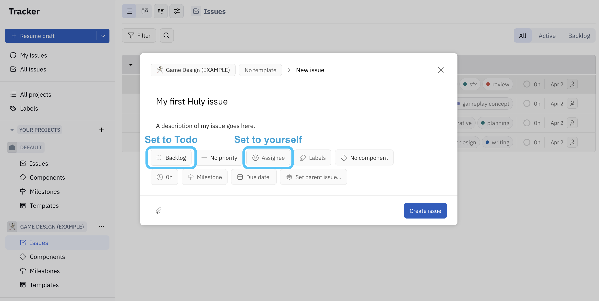

An **issue** represents a specific task that needs to be completed. Projects can contain many issues and sub-issues.

---

### Task 3 - Assign yourself an issue

**_Assigning an existing issue:_**

Now it’s time to assign yourself an issue in your `GAME DESIGN` project! Follow these steps:

1. First, navigate back to the `GAME DESIGN` project in the left side panel and select `Issues`.
2. Click to open any issue that interests you.
3. In the right side panel, open `Assignee` and select **yourself**.
4. Set the issue `Status` to **Todo**. ❗_This is important for the next step!_

**_Creating a new issue (optional alternative)_**

Instead of assigning an existing issue to yourself, you can also create a new issue!

1. Click the blue `+ New Issue` button at the top of the side panel (or press `C` from any view).
2. Enter some information about your issue, such as a title and description.
3. Set the `Assignee` to **yourself**. 
4. Set the `Status` to **Todo**. ❗_This is important for the next step!_
5. Click `Create issue`.

---

🎉 Congratulations! You’ve completed Task 3 ✅  

### Next: Task 4 - Schedule your first Action Item 

In the next step, you’ll learn how Huly has automatically created an Action Item for the issue you just assigned, which you’ll schedule in your personal Planner. Click the button below to continue!

### ➡️ [4.Action Item.md](./4.ActionItem.md)
