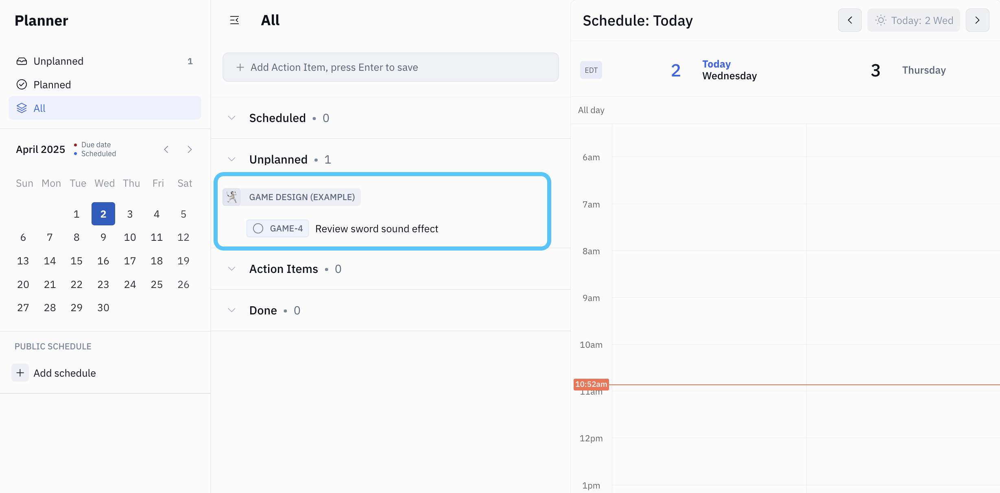
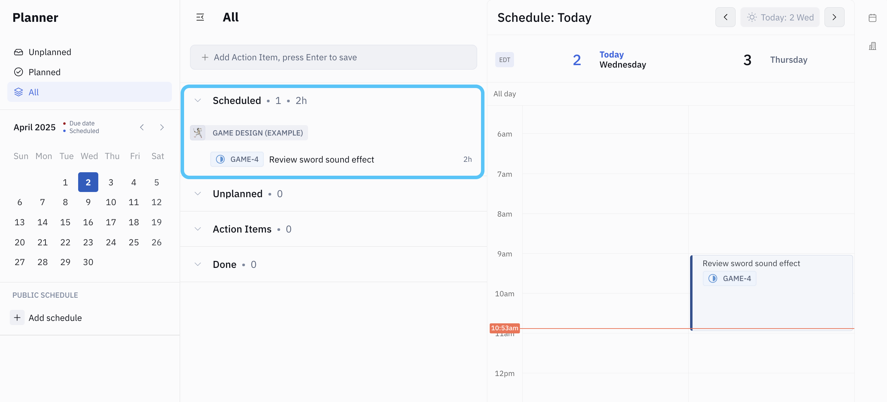

An **Action Item** is a task to be completed by a specific team member. 

> 🤔 But wait … didn’t we just create an **issue** assigned to a team member? What’s the difference? 

At a glance:
* **Issue** - work that needs to be completed 
* **Action Item** - an individual’s responsibility to complete that work

When an **issue** is created with the status of “Todo” and assigned to a team member, that team member receives a corresponding **Action Item** in their personal Planner.

---

### Task 4 - Schedule your first Action Item

Because you set the issue status to “Todo” and assigned it to yourself in the previous step, you’ve received a corresponding Action Item for that issue. Head over to your **Planner** by clicking the calendar icon in the left sidebar. There, you’ll see an Action Item for the issue you just assigned!

There are 2 ways to schedule an Action Item:
* Click and drag the Action Item to your calendar on the right side panel, _or_
* Click on the Action Item to open it in the right side panel. Click `Add Slot` to create a time slot representing when you plan to do the work. From there, you can adjust the day and time and add more slots if needed.

Notice that when you schedule an Action Item, it moves from “Unplanned” to “Scheduled” on the list:

Now, navigate back to the **issue**. Notice that the status automatically updated to “In Progress”! That’s because you scheduled your Action Item, indicating your commitment to completing the work.

If you’d like, go ahead back to your Planner and check off your Action Item by clicking the round checkbox that appears when you hover over it. You’ll see that the Issue status automatically updates to “Done”.

---

🎉 Congratulations! You’ve completed Task 4 ✅  

### Next: Task 5 - Explore Cards

Now that you know how to create and assign tasks and schedule your Action Items, let’s take a look at how you can create a knowledge base of information in your workspace!

### ➡️ [5.Explore.md](./5.Explore.md)
