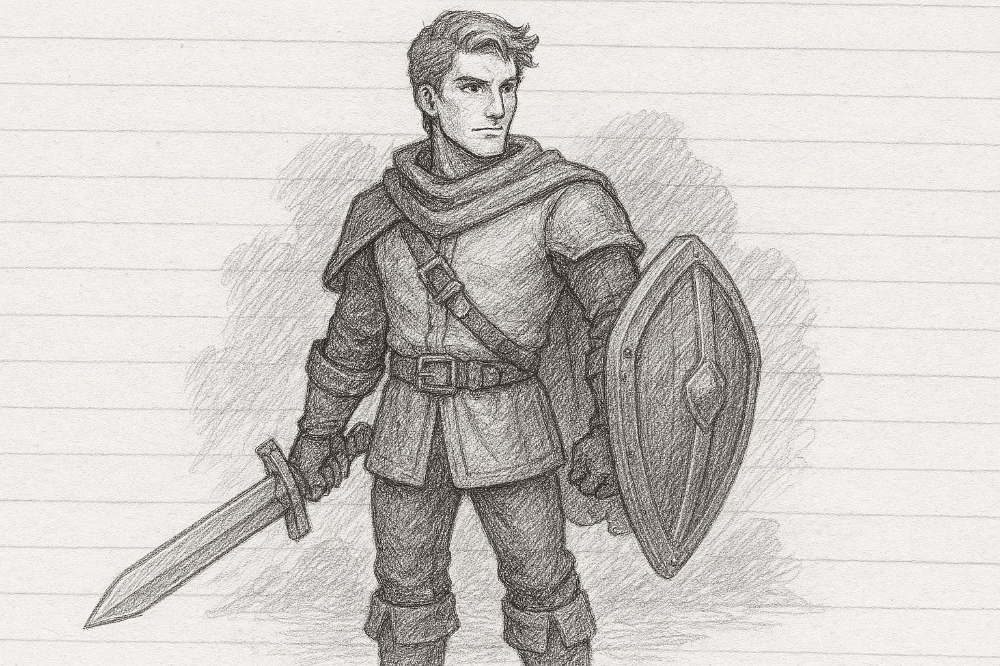

**The Hero** is a courageous and determined adventurer tasked with saving the world from impending doom. With a mysterious past and a drive to uncover their true purpose, they wield a unique combination of magic and physical combat skills. Their journey is one of personal growth, as they encounter challenges, forge alliances, and ultimately face a dire prophecy that threatens to reshape the world. As the story unfolds, the Hero gains new abilities, unlocks ancient secrets, and makes choices that shape the outcome of their quest.

