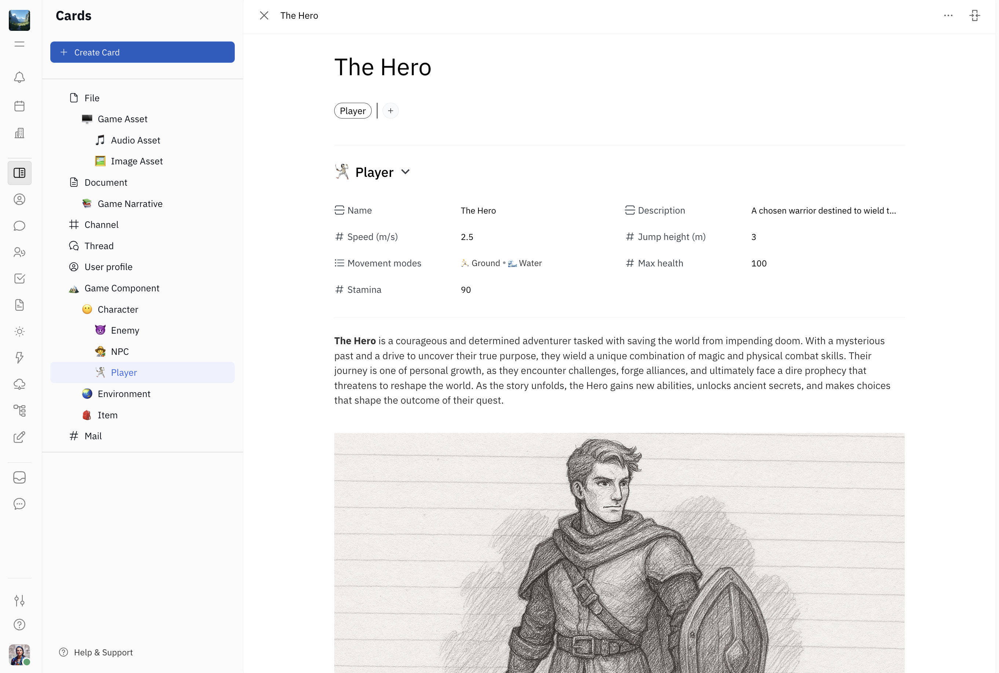

### **Welcome to Huly, your all-in-one project management platform!** 

Embark on an exciting journey to learn the essential tools available to you on the Huly Platform! Huly includes powerful features for collaborative editing, knowledge management, video conferencing and more.

As you explore your workspace, you’ll find **game characters**, **narrative documents** and **game assets**. We’ll get you started with a basic game design system that you can expand upon yourself — or simply use as a reference for how you can collaborate with your team on Huly!

Here’s a sneak peek 👀

Let’s get started! You’ll complete 5 tasks to learn about the essential features of the Huly platform:

1. Welcome to Huly! 🌟 (you are here!)
2. Create your first Project 📌
3. Create your first Issue 📝
4. Schedule your first Action Item 📆
5. Explore Cards 🗂️

Once you're familiar with Huly, feel free to delete these starter tasks or keep them as reference.

---

🎉 Congratulations! You’ve completed Task 1 just by getting started ✅ Click below to proceed to Task 2!

### Next: Task 2 - Check out your first Project 📌

We’ve created an example Project called `GAME DESIGN` to help you learn how projects work in Huly. In the next step, you’ll learn how to open a project and view issues (tasks). Let’s go! 🚀

### ➡️ [2.Project.md](./2.Project.md)
