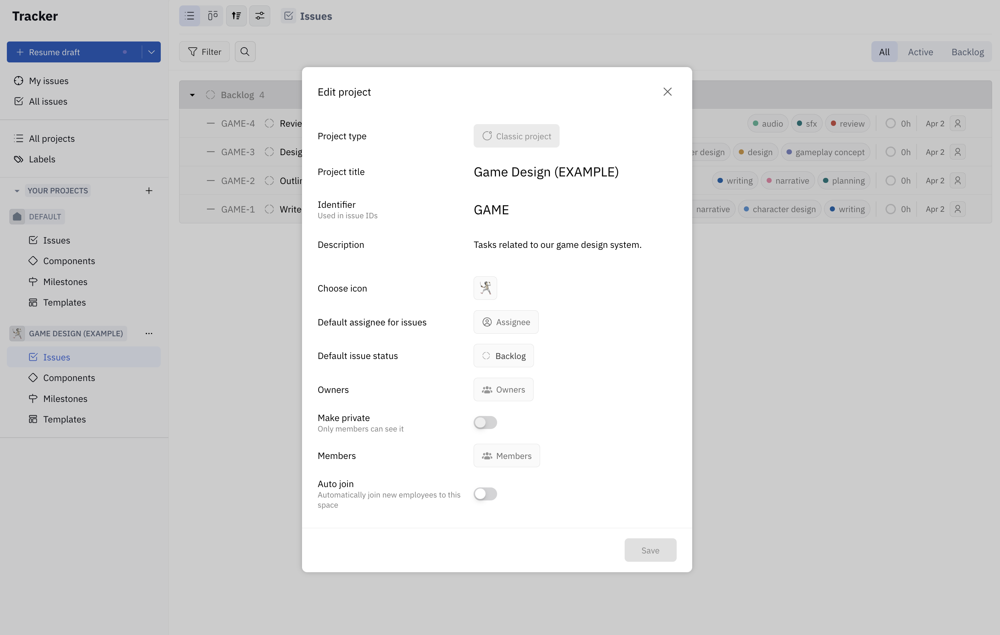
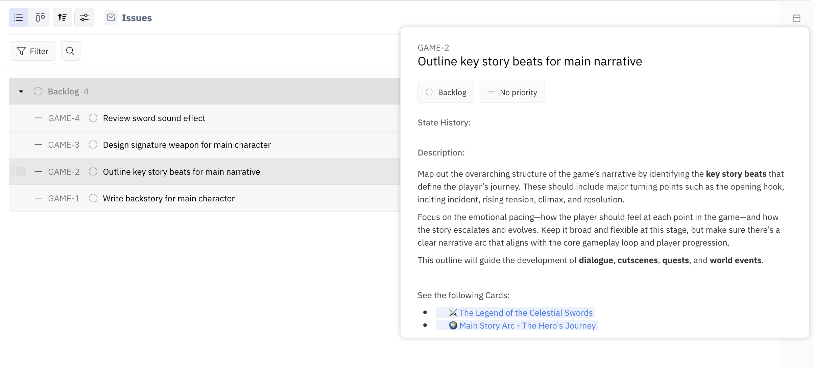

**Projects** contain all the tasks your team will be working on. We’ve set you up with an example project called `GAME DESIGN`.

---

### Task 2 - Check out your first project

**_Edit project details:_**
* Hover over the `GAME DESIGN` project in the left side panel. Click the `…` settings menu and select `Edit project` from the menu. Here, you can edit the title, description, default assignee, and set privacy details.

View issues:
* Click `Issues` to see all issues (tasks) in this project. Click to open any issue, or hover over the issue and press `Space` on your keyboard to open an issue peek! With issue peek open, you can preview the issues by pressing the up and down arrows on your keyboard, or press `Space` to close.

Explore Cards:
* Note that each issue lists some related **Cards**. Feel free to check these out now — just be sure to come back here to complete the next task!

---

🎉 Congratulations! You’ve completed Task 2 ✅ 

### Next: Task 3 - Assign an issue to yourself 📝

Next, you’ll learn how to assign one of these issues to yourself. Let’s go!

### ➡️ [3.Issue.md](./3.Issue.md)
