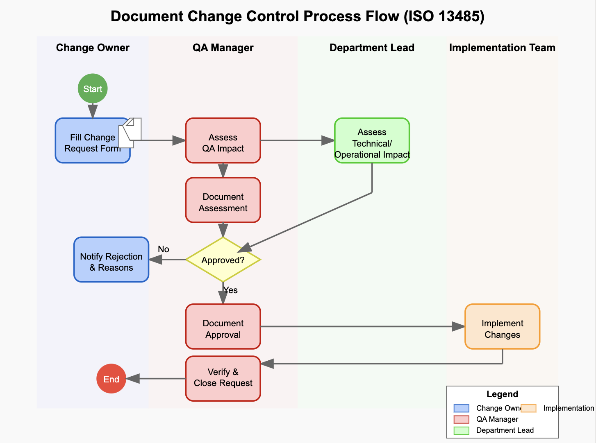

**[Keep in mind that this document content is just an illustration to show you how this could look like, but please create your own content. If needed, we can put you in touch with experts to help you out.]**

## Scope

This Standard Operating Procedure (SOP) applies to all departments involved in initiating, reviewing, approving, and implementing changes to controlled documents, quality records, and product specifications.

The procedure is intended to ensure compliance with ISO 13485 and maintain full traceability and impact assessment of all changes.

---

## Glossary

| Term           | Definition                                         |
|----------------|----------------------------------------------------|
| Change Request | A formal proposal to modify a document or process |
| Impact Analysis| Evaluation of the potential effects of a change   |

---

## Responsibilities

| Role             | Responsibility                                 |
|------------------|-----------------------------------------------|
| Change Owner     | Initiates and documents the change request     |
| QA Manager       | Assesses impact and ensures compliance         |
| Department Lead  | Reviews feasibility and approves implementation|

---

## Process Flowchart

The following flowchart illustrates the change control process:

---

## Procedure

1. **Initiation**  
   The Change Owner fills out a Change Request Form with a clear description of the proposed change, reason, and affected items.

2. **Impact Assessment**  
   QA reviews the request for regulatory or quality impact. Relevant department leads assess technical or operational impact.

3. **Approval**  
   Once assessed, the QA Manager and affected Department Leads approve or reject the request.

4. **Implementation**  
   Upon approval, changes are implemented by the responsible team. Updated documents are versioned and distributed.

5. **Closure**  
   QA verifies completion and closes the change request, ensuring all documentation is updated.

... [Feel free to make any changes or additions to this document during your TraceX exploration.]
