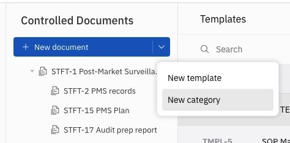
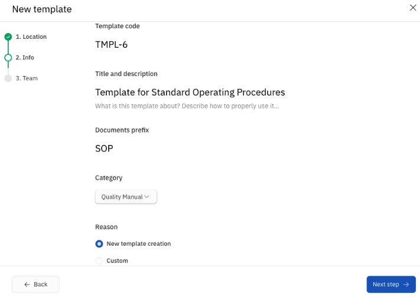

Templates in TraceX allow you to standardize controlled documents so your team can quickly create new records that follow the same structure and compliance format. 

ℹ️ Note: For the record you created in the previous steps, you used a pre-created template as the starting point.

The process to create a template is very similar to creating a new controlled document, but with a few key differences explained below.

---

## 🔨 How to Create a Template

From the **Controlled Documents** module, click the dropdown next to the **“+ New Document”** button and select **New Template**.

---

### Step 1 – Choose a space and parent

Just like documents, the space defines permissions.

---

### Step 2 – Fill in template-specific details:

- Review the autofilled template code  
- Add a template title and description  
- Define the prefix for the documents that will be created from this template  
- Select a category (used to group templates and documents together. You can create custom categories as needed)

---

### Step 3 – Assign team

Select Co-Authors (optional), Reviewers (optional), and Approvers.

Since you’re the only user in this workspace for now, you can assign yourself to keep the approval workflow moving.

Click **Create Draft** to finalize the template creation.

---

Once created, you can:

- Edit the template content using the same editor tools as a document  
- Go through an approval workflow just like a regular document  

Once your template is created, you can use it as the base for any future controlled document — saving time and ensuring consistency across your QMS.

---

🎉 Congratulations! You’ve now completed **Step 5** ✅

### Next: 🚀 Step 6 – Explore everything TraceX has to offer ➡️ [6.step-6-explore-tracex.md](./6.step-6-explore-tracex.md)
