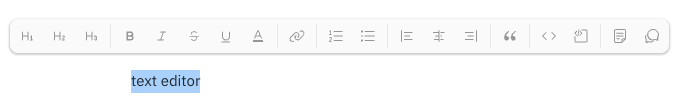
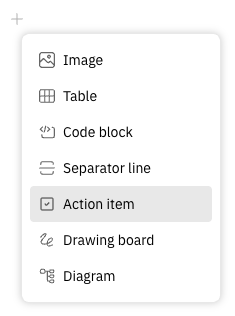

# **Documents vs. Controlled Documents in TraceX**

TraceX offers two powerful document modules designed for different use cases:

- 🧾 **Documents**: A flexible, wiki-style module ideal for day-to-day collaboration, notes, internal guides, and dynamic project documentation. Perfect for fast iteration and informal knowledge sharing with your team.

- 🗂️ **Controlled Documents**: Designed for **regulated content** — such as procedures, policies, and technical documents — this module includes **version control**, **approval workflows**, **change controls**, **effective date management**, and full **audit trails** to meet regulatory requirements (e.g. ISO 13485, FDA 21 CFR Part 11).

Both modules share the same powerful editor, which supports:

- Rich markdown formatting  
- Embedding images, tables, and code blocks  
- Adding Action Items, Drawing Boards, and Diagrams  
- Linking issues or attaching external documents  
- Collaborative editing with @mentions and inline comments  

This guide focuses on the **Documents** module.  
To learn how to create and manage controlled, versioned content with formal reviews and approvals, check out our [Controlled Documents video tutorial](https://youtu.be/bUzj7ejkwUk?si=rJUt74aQ3Qn5Nno8).

# **Creating a teamspace**

Documents are organized into teamspaces, which can be used to model your team’s organizational structure. For example, you may choose to organize your documents into teamspaces called “Features”, “Marketing”, “Style Guides” etc.

To create a teamspace, click the `+` that appears when hovering over the word “Teamspaces” in the sidebar, or by clicking the dropdown arrow next to the `+ Create a Document` button and selecting `Create teamspace`.

# **Creating a document**

There are two ways to create a document:

Click the `+ Create a document` button at the top of the sidebar. This opens a dialog with the option to select a teamspace for your document; the default parent will be the most recently selected teamspace or document. Enter a title for your document and click `Create`.

Alternatively, hover over the a teamspace name or any other document and click the `+` button that appears. The new document will automatically be nested within the teamspace or document you selected.

# **Formatting document content**

Documents support markdown formatting. There are a few ways to access formatting options for your text:

* Type markdown syntax directly into your document.
* Use the floating toolbar that appears when text is selected on the page.

Using markdown formatting, you can add headers, text emphasis, links, blockquotes, numbered and bulleted lists, and code blocks to your document.

You can also add elements such as images, action items, drawing boards and more by typing `/` or clicking the `+` icon at the left side of the document.

# **Enrich your documents with @mentions, Action Items and live collaboration**

Documents are directly integrated within the rest of the TraceX platform, making it easy to tag team members, assign Action Items and link to issues. Team members can collaborate in real time, eliminating the need to send files back and forth or meet to discuss revisions.

# **Mentions**

Mention a team member by using @mention syntax. The member will receive a notification that they have been mentioned in the document. 

# **Creating Action Items**

Create an Action Item by typing `[]` then `space` on a new line. Alternatively, type `/`or clicking the `+` icon at the left side of the document and select `Action Item` from the dropdown menu. An empty checkbox will appear, and as you begin typing, a profile icon will appear to the left of the checkbox. Click this icon to select a team member to assign the Action Item to. That team member will receive a notification that they have been assigned an Action Item, and they’ll be able to schedule the Action Item in their Planner.

* [ ] You can assign an Action Item any time by hovering over the checkbox and clicking the profile icon. 
* [ ] Try assigning these Action Items to yourself!

# **Real-time collaboration**

Team members can collaborate on documents at the same time! Multiple people can edit and add to documents simultaneously. You can also have discussions at the bottom of the page, or highlight text anywhere to add inline comments. Check out our [video](https://www.youtube.com/watch?v=cspdJ5TjFNQ) to learn more about collaborative editing in TraceX documents!
