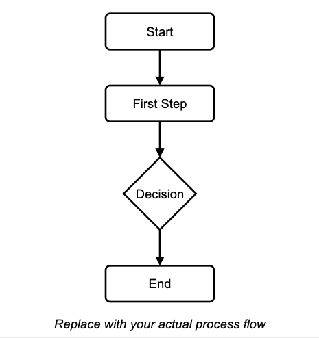

**[Keep in mind that this document content is just an illustration to show you how this could look like, but please create your own content. If needed, we can put you in touch with experts to help you out.]**

## Scope
This Standard Operating Procedure (SOP) is applicable to [specify departments, teams, processes, or functions] involved in [specify the aspects of medical device lifecycle covered, such as design, development, production, quality control, distribution, etc.]. It outlines the procedures for [briefly describe the main activities or processes the SOP governs].

The SOP is intended to ensure compliance with ISO 13485 standards, [mention any other relevant regulations or standards], and applies to [specific types of medical devices or services, if applicable].

**Exclusions:** [If applicable, clearly identify any aspects, departments, or processes that are not covered by this SOP, and provide a brief justification for each exclusion].

---
## Referenced Documents
[List any referenced SOPs, standards, or regulatory documents here.]

---
## Glossary
[Define relevant terms or acronyms.]

---
## Responsibilities
| Role             | Responsibility            |
|------------------|---------------------------|
| QA Manager       | [Define responsibility]   |
| R&D Lead         | [Define responsibility]   |

---
## Process Flowchart

[The following flowchart is just a placeholder illustration and should be replaced in each procedure with an appropriate one]:

---
## Procedure
1. [Step-by-step instruction]
2. [Next step]

---
... [Feel free to make any changes or additions to this document during your TraceX exploration.]
