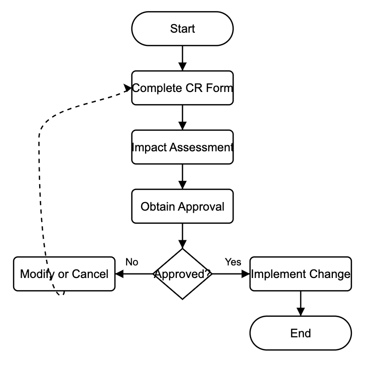

**[Keep in mind that this document content is just an illustration to show you how this could look like, but please create your own content. If needed, we can put you in touch with experts to help you out.]**

## Scope
This Work Instruction (WI) provides detailed step-by-step guidance for implementing the Change Management Procedure. It applies to all personnel involved in initiating, documenting, reviewing, approving, and implementing changes to controlled documents, processes, or product specifications.

---

## Process Flowchart

The following flowchart illustrates the change management process:

---

## Glossary
| Term              | Definition                                           |
|-------------------|------------------------------------------------------|
| Change Request    | A formal proposal to modify a document or process    |
| Impact Assessment | Evaluation of the potential effects of a change      |
| CR Form           | Change Request Form used to document proposed changes|

---

## Responsibilities
| Role             | Responsibility                                        |
|------------------|-------------------------------------------------------|
| Change Owner     | Completes CR Form and follows up on implementation    |
| QA Reviewer      | Performs impact assessment from quality perspective   |
| Technical Lead   | Evaluates technical feasibility and implementation    |
| Change Committee | Reviews and makes final approval decision on changes  |

---

## Procedure
### 1. Completing the Change Request Form
1.1. Access the Change Request Form template in TraceX.

1.2. Complete all required fields:
   - Change description (be specific and detailed)
   - Reason for change
   - Systems, documents, or processes affected
   - Proposed implementation date
   - Your contact information

1.3. Attach supporting documentation as needed (e.g., marked-up documents).

1.4. Submit the form for review.

### 2. Conducting Impact Assessment
2.1. Quality Assessment:
   - Identify any regulatory impacts
   - Document compliance considerations
   - Evaluate validation requirements

2.2. Technical Assessment:
   - Evaluate feasibility of implementation
   - Document resource requirements
   - Identify potential risks and mitigations

2.3. Documentation:
   - Complete the Impact Assessment section of the CR Form
   - Recommend approval or rejection with justification
   - Sign and date the assessment

### 3. Obtaining Approval
3.1. Submit completed CR Form with impact assessments to Change Committee.

3.2. Schedule change review meeting if required.

3.3. Present change proposal to stakeholders.

3.4. Document all feedback and decisions.

3.5. Obtain final signatures from all required approvers.

### 4. Implementing the Change
4.1. Update all affected documents with appropriate revision control.

4.2. Communicate changes to all affected personnel.

4.3. Provide training if required.

4.4. Implement the change according to the approved plan.

4.5. Document evidence of implementation.

### 5. Closing the Change
5.1. Verify all implementation steps are complete.

5.2. Collect and file all documentation.

5.3. Complete the closure section of the CR Form.

5.4. Obtain final QA verification signature.

5.5. Archive the completed change request.
