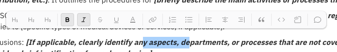
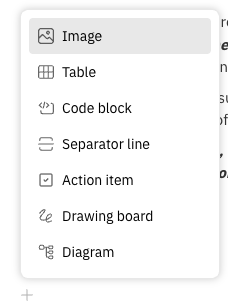

Now that your draft is created, you can start editing your document. All controlled documents, whether SOPs, WIs, or other types, offer the same powerful editing features.

⚙️ **Editing & Formatting Tools**

TraceX provides flexible ways to enrich your documents through the text editor toolbar and the section tools.

### 1️⃣ Text Editor Toolbar
You can directly format your content using the rich text editor.

Features include:
- Markdown formatting
- Bold, italic, underline
- Headers and lists
- Links, tags, and inline code

### 2️⃣ Section Block Tools
By clicking the ➕ icon on the left side of any document row, you can insert dynamic content blocks like:
- Images
- File attachments
- Tables
- Action items
- Diagrams
- Drawing boards
- Embedded content

This lets you structure documents exactly how your team works.

🎉 Congratulations! You’ve now completed Step 3 ✅

### Next: ✅ Step 4 – Review and approve your document ➡️ [4.step-4-review-approval.md](./4.step-4-review-approval.md)
